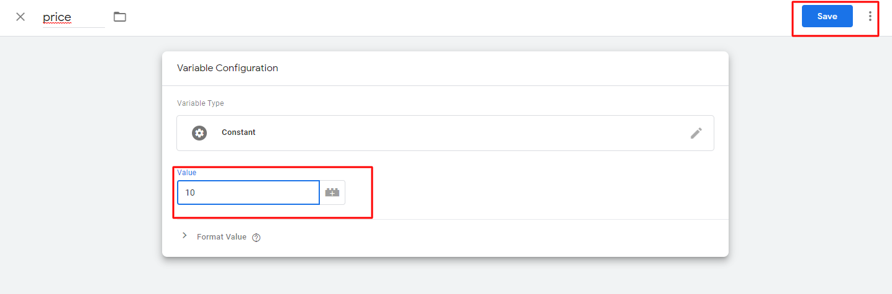

# ReklamStore-DSP-Conversion-Pixel
ReklamStore DSP Conversion Pixel GTM Template

## Installation

1. Download the `template.tpl` file

2. Create a new tag template in the Templates menu
    
    
3. Import the `template.tpl` file
    
    
4. Save Template
    
    
5. Create new price Variable
    
   
6. Add variable name and select  variable configuration.(<b>Note:
In the example here, variables are constant.
If you have dynamic variable , use the data layer variable.So you can use dynamic data as a variable.</b>)
    
    
7. Select Constant in Utilities
    

8. Enter price variable value and save your price value.
    

9. Create the clickId variable by following the same steps as the price variable<b>(ref:5-8)</b>.

10. Create a new Tag.
    

11. Enter a tag name and Select tag type in Custom.
    

12. Select price and clickId variables for new Tag.
    
    
13. Select price Variable.
     

14. Select the clickId variable by following the same steps as the price variable<b>(ref:12-13)</b>.

15. Create new trigger for your tag.
    
    
16. Select plus sign.
    

17. Enter trigger name and select trigger configuration
    

18. Select Page View.
    

19. Set the page where Trigger will fires on and save trigger.
    

20. Save tag and <b>Submit<b> workspace changes.
    
